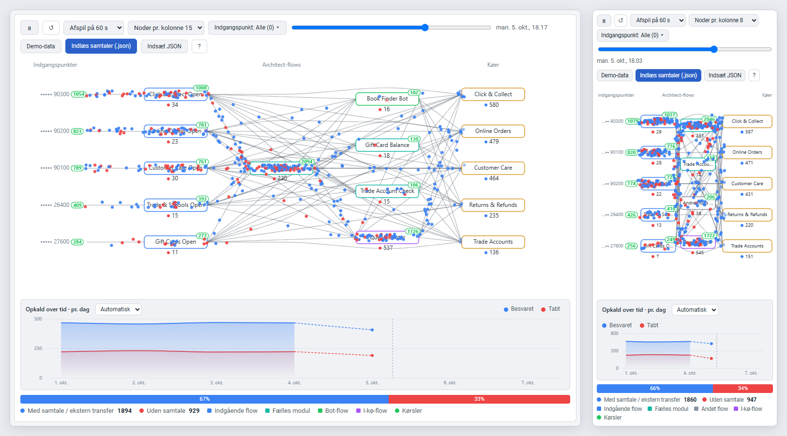

# Genesys Traffic Widget

[English](README.md) · **Dansk**

Traffic-visningen fra Flow-diagram-tool som en selvstændig widget, der kører **inde i Genesys Cloud**.
Opkald afspilles som prikker, der løber *indgangspunkt → Architect-flow → kø*. Blå betyder, at nogen tog opkaldet, og rød betyder, at det endte uden samtale.



Widget'en logger ind med **den Genesys-org, den bliver vist i**, og med **den bruger, der er logget ind**. Der er ingen server, ingen client secret og ingen kundeliste. Tokenet har kun brugerens egne rettigheder.

## Sådan virker login

1. Genesys Cloud åbner widget'en i en iframe med integrationens URL og udfylder `{{gcHostOrigin}}`, `{{gcLangTag}}` osv.
2. Widget'en finder regionen ud fra `gcHostOrigin` (fx `https://apps.mypurecloud.de` → `mypurecloud.de`), eller fra `pcEnvironment`/`region`, hvis de er sat.
3. Den starter OAuth *Authorization Code + PKCE* mod `login.<region>` med org'ens OAuth-klient (`clientId` i URL'en). Brugeren er allerede logget ind i Genesys Cloud, så loginnet går som regel igennem uden at spørge.
4. Tokenet ligger kun i iframens `sessionStorage`. Data hentes direkte fra `api.<region>` (Analytics conversation details jobs plus kølisten).

Genesys giver ikke en indlejret app adgang til selve UI'ets token, så "org'ens credentials" betyder her en OAuth-klient i org'en plus brugerens eksisterende Genesys-session. Det er den måde, Genesys anbefaler.

## Opsætning i en Genesys-org

**1. Hosting.** Læg filerne (`index.html`, `css/`, `js/`) på en HTTPS-host, fx GitHub Pages, Azure Static Web Apps eller S3 + CloudFront. Genesys indlejrer kun HTTPS-sider. Én hosting kan bruges af alle org'er.

**2. OAuth-klient** (Admin → Integrations → OAuth → Add Client):
- Grant type: **Code Authorization** (PKCE, uden secret)
- Authorized redirect URI: widget'ens URL **uden query**, fx `https://skndkprivat.github.io/genesys-traffic-widget/`
- Scope: `analytics:readonly`, `routing:readonly`, `organization:readonly`, `users:readonly` (eller ingen scopes, så gælder brugerens fulde rettigheder)

**3. Integration** (Admin → Integrations → + Integrations → **Client Application**):
- *Application URL*:
  ```
  https://skndkprivat.github.io/genesys-traffic-widget/?clientId=<CLIENT-ID>&gcHostOrigin={{gcHostOrigin}}&gcTargetEnv={{gcTargetEnv}}&gcLangTag={{gcLangTag}}
  ```
- *Application Type*: `standalone` (vises under *Apps*-menuen) eller `widget`, hvis den skal ligge i agentens sidepanel
- *Iframe Sandbox Options*: `allow-scripts,allow-same-origin,allow-forms,allow-modals,allow-downloads,allow-popups`
- *Group Filtering*: begræns evt. til en gruppe, fx supervisorer
- Slå integrationen **Active**

**4. Rettigheder** for brugerne: `analytics:conversationDetail:view` og `routing:queue:view`.

Hver org skal have sin egen OAuth-klient og integration. Koden og hostingen er den samme for alle.

### URL-parametre

| Parameter | Betydning |
|---|---|
| `clientId` | OAuth client ID i den aktuelle org (påkrævet) |
| `gcHostOrigin` / `pcEnvironment` / `region` | Bestemmer regionen. Kun kendte Genesys-domæner accepteres |
| `gcLangTag` / `lang` | Sprog: da, en, fr, es eller nl (ellers engelsk) |
| `theme` | `light` eller `dark` (ellers følges styresystemet) |
| `demo` | Viser demodata uden login, til afprøvning uden for Genesys |

## Lokal afprøvning

```bash
npm start
```

Åbn `http://localhost:8080/?demo`. Login kan kun testes rigtigt fra en HTTPS-host via integrationen. Vil du teste uden for Genesys, kan du åbne `https://skndkprivat.github.io/genesys-traffic-widget/?clientId=…&region=mypurecloud.de` direkte i browseren.

```bash
npm test
```

Skærmbillederne i README'erne (`docs/traffic-widget.png` på engelsk og `docs/traffic-widget-da.png` på dansk) kan tages igen efter ændringer:

```bash
npm run screenshot
```

Scriptet (`tools/screenshot.mjs`) starter sin egen lille server og en lokal Edge eller Chrome i headless-tilstand. Begge layouts vises side om side, midt i afspilningen af demodata. Kan browseren ikke findes, sætter du `BROWSER=<sti til msedge/chrome>`. `LANG_TAG=da` tager kun det danske billede.

## Forskelle fra Traffic i Flow-diagram-tool

- Ingen kundeliste eller `.env`. Org'en og regionen kommer fra Genesys.
- Ingen server. Det er rene statiske filer.
- Logger automatisk ind og henter den valgte periode (standard: seneste 7 dage), når widget'en åbnes.
- Org'ens navn og brugerens navn står i værktøjslinjen.
- Når man er logget ind via Genesys, vises kun *Hent live* og periode. Demo-data, indlæsning/indsætning af JSON og API-hjælpen vises kun i `?demo`-tilstand.
- Smalle paneler (under 560 px, fx agentens sidepanel) får et kompakt layout: højst 2 flow-kolonner, 8 bokse pr. kolonne som standard, mindre tekst, køerne helt ude til højre og tællerne inde i boksen, når der ikke er plads under den.

Afspilning, diagram, filtre, graf, klik-grid og CSV-eksport er de samme. `js/traffic.js` er en kopi, hvor kun live-login-delen er ændret. Rettelser i parse-logikken skal derfor laves begge steder, indtil de evt. flyttes til en fælles pakke.
