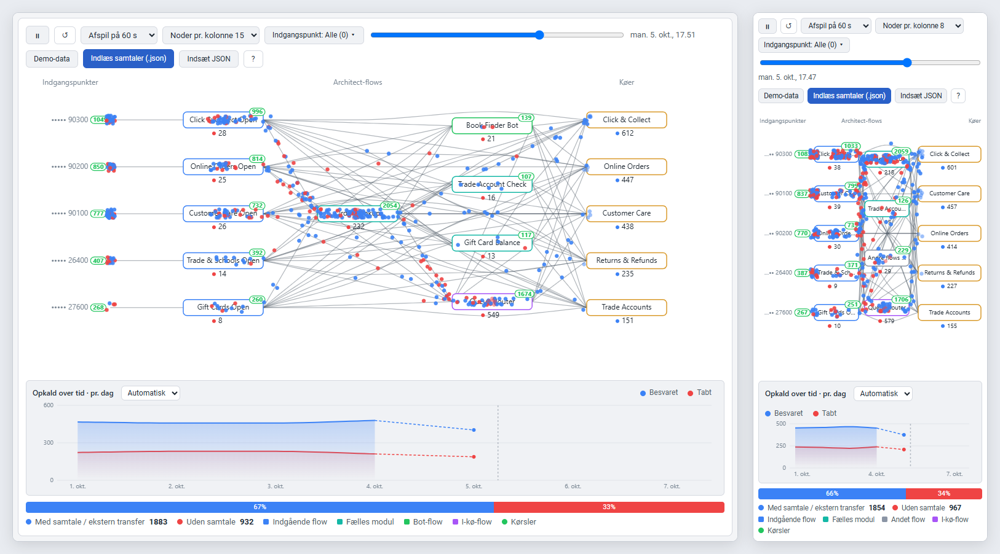

# Genesys Traffic Widget

**English** · [Dansk](README.da.md)

A widget that shows call traffic and runs **inside Genesys Cloud**.
Calls are replayed as dots flowing *entry point → Architect flow → queue*. Blue means somebody took the call, and red means it ended without a conversation.



The widget signs in with **the Genesys org it is shown in** and **the user who is signed in**. There is no server, no client secret and no customer list. The token only has the user's own permissions.

## How sign-in works

1. Genesys Cloud opens the widget in an iframe with the integration's URL and fills in `{{gcHostOrigin}}`, `{{gcLangTag}}` and so on.
2. The widget works out the region from `gcHostOrigin` (e.g. `https://apps.mypurecloud.de` → `mypurecloud.de`), or from `pcEnvironment`/`region` if they are set.
3. It starts OAuth *Authorization Code + PKCE* against `login.<region>` with the org's OAuth client (`clientId` in the URL). The user is already signed in to Genesys Cloud, so the sign-in usually completes without asking.
4. The token is kept only in the iframe's `sessionStorage`. Data is fetched directly from `api.<region>` (Analytics conversation details jobs plus the queue list).

Genesys does not give an embedded app access to the UI's own token, so "the org's credentials" here means an OAuth client in the org plus the user's existing Genesys session. This is the approach Genesys recommends.

## Setting it up in a Genesys org

**1. Hosting.** Put the files (`index.html`, `css/`, `js/`) on an HTTPS host, e.g. GitHub Pages, Azure Static Web Apps or S3 + CloudFront. Genesys only embeds HTTPS pages. One hosting can serve every org.

**2. OAuth client** (Admin → Integrations → OAuth → Add Client):
- Grant type: **Code Authorization** (PKCE, no secret)
- Authorized redirect URI: the widget's URL **without a query**, e.g. `https://skndkprivat.github.io/genesys-traffic-widget/`
- Scope: `analytics:readonly`, `routing:readonly`, `organization:readonly`, `users:readonly` (or no scopes, so the user's full permissions apply)

**3. Integration** (Admin → Integrations → + Integrations → **Client Application**):

> Choose **Client Application**, not *Interaction Widget*. An Interaction Widget is tied to a conversation: it is only shown next to an active interaction and gets a new instance per conversation. A Client Application is always available, also outside conversations.

- *Application URL*:
  ```
  https://skndkprivat.github.io/genesys-traffic-widget/?clientId=<CLIENT-ID>&gcHostOrigin={{gcHostOrigin}}&gcTargetEnv={{gcTargetEnv}}&gcLangTag={{gcLangTag}}
  ```
- *Application Type*:
  - `standalone` (recommended): fills the whole Genesys window, so the diagram is easiest to read. Opened from the *Apps* menu, or from *Performance* / *Directory* depending on the *Application Category*. *Performance* puts it next to Genesys' own dashboards
  - `widget`: a tab in the left sidebar (the Apps icon), always available and not tied to a conversation. Here the compact narrow layout is used
  - You can create both as two Client Application integrations with the same URL and the same OAuth client
- *Iframe Sandbox Options*: `allow-scripts,allow-same-origin,allow-forms,allow-modals,allow-downloads,allow-popups`
- *Group Filtering*: optionally limit it to a group, e.g. supervisors
- Set the integration to **Active**

**4. Permissions** for the users: `analytics:conversationDetail:view` and `routing:queue:view`.

Each org needs its own OAuth client and integration. The code and the hosting are the same for all of them.

### URL parameters

| Parameter | Meaning |
|---|---|
| `clientId` | OAuth client ID in the current org (required) |
| `gcHostOrigin` / `pcEnvironment` / `region` | Sets the region. Only known Genesys domains are accepted |
| `gcLangTag` / `lang` | Language: da, en, fr, es or nl (otherwise English) |
| `theme` | `light` or `dark` (otherwise follows the operating system). The ☾/☀ button in the toolbar overrides it and is remembered per browser |
| `demo` | Shows demo data without sign-in, for trying it out outside Genesys |

## Trying it locally

```bash
npm start
```

Open `http://localhost:8080/?demo`. Sign-in can only really be tested from an HTTPS host through the integration. To test outside Genesys, open `https://skndkprivat.github.io/genesys-traffic-widget/?clientId=…&region=mypurecloud.de` directly in the browser.

```bash
npm test
```

The README screenshots (`docs/traffic-widget.png` in English and `docs/traffic-widget-da.png` in Danish) can be retaken after changes:

```bash
npm run screenshot
```

The script (`tools/screenshot.mjs`) starts its own small server and a local Edge or Chrome in headless mode. Both layouts are shown side by side, part-way through the demo data replay. If the browser cannot be found, set `BROWSER=<path to msedge/chrome>`. `LANG_TAG=en` takes the English picture only.

## How the widget behaves

- Signs in automatically and fetches the selected period (default: last 7 days) when the widget opens.
- The org name and the user's name are shown in the toolbar.
- When signed in through Genesys, only *Live data* and the period are shown. Demo data, loading/pasting JSON and the API help are only shown in `?demo` mode.
- Narrow panels (under 560 px, e.g. the agent's side panel) get a compact layout: at most 2 flow columns, 8 boxes per column by default, smaller text, the queues against the right edge and the counters inside the box when there is no room under it.
